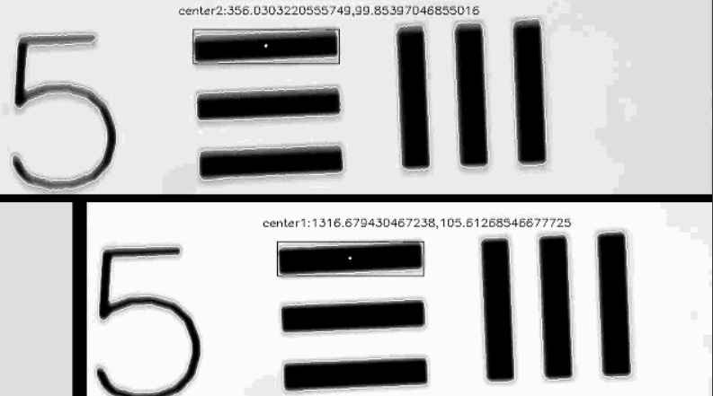

# calc-los-center
 recognizes center of area of 2 objects in a vid and logging it to csv

This Script takes a video with 2 moving object and outputs each object center X,Y displacements to "centers_displ.csv"
steps:
1. Pick ROIs in the following order:

    * a. Crop the frame to smaller ROI of the frame that includes the 2 objects -> Press enter/space to verify the ROI -> Press ESC
    * b. The cropped region is opened now, Pick ROI for the first object center moving region (i.e. , the region which in every frame the center would be found inside) -> verify by pressing Enter/Space
    * c. do the same as b. for the second object ROI
    * d. press ESC

2. The script now is running and computing center displacements for objects 1 and 2
3. In the output folder images you will find:
    * a. the output video
    * b. "centers_displ.csv"

4. "centers_displ.csv" could be analyzed with "Analyze_centers_disp_DF.py" script
